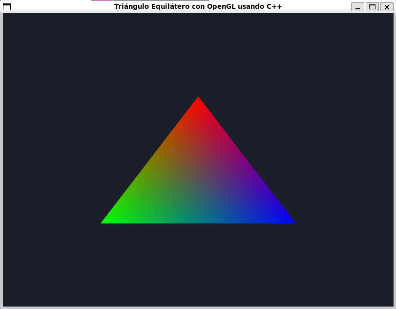

# Mini Proyecto con OpenGL con C++: Triángulo Coloreado

### Gámez J.- 16-10396 - API: OpenGL 
### Sistema Operativo: WSL2 

Este es un proyecto simple que utiliza Three.js para renderizar un triángulo coloreado en una escena 2D en una ventana.

## Dependencias

- OpenGL
- GLFW
- GLEW
- CMake

## Necesitas

1. **Instalar GLFW**: Sigue las instrucciones de instalación de [GLFW](https://www.glfw.org/download.html).

2. **Instalar GLEW**: Sigue las instrucciones de instalación de [GLEW](http://glew.sourceforge.net/).

3. **Instalar CMake**: Si no tienes CMake, puedes instalarlo desde [CMake](https://cmake.org/download/).

## Instrucciones para correr el proyecto

Para ejecutar este proyecto, sigue estos pasos:

1. Clona el repositorio:
   ```bash
   git clone <url-del-repositorio>

2. Navega a la carpeta del proyecto.
   ```bash
   cd APIOpenGL

3. Compila el proyecto:

   ```bash
   make

4. Ejecuta la aplicación:

   ```bash
   ./triangle_app

## Capturas de Pantalla

