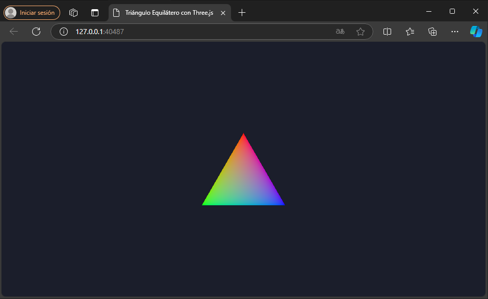

# Mini Proyecto Three.js: Triángulo Coloreado

### Gámez J.- 16-10396 - API: Three.js 
### Sistema Operativo: WSL2 

Este es un proyecto simple que utiliza Three.js para renderizar un triángulo coloreado en una escena 2D.

## Dependencias

- [Node.js](https://nodejs.org/)
- [Three.js](https://threejs.org/)
- `live-server` (para ejecutar un servidor local)

## Necesitas

1. Instalar [Node.js](https://nodejs.org/): Necesario para ejecutar el servidor local.

2. Instala three.js 

   ```bash
   npm install three

3. Instalar un servidor local como `live-server` con el comando:

   ```bash
   npm install -g live-server

## Instrucciones para correr el proyecto

Para ejecutar este proyecto, sigue estos pasos:

1. Clona el repositorio:
   ```bash
   git clone <url-del-repositorio>

2. Navega a la carpeta del proyecto.
   ```bash
   APIThreeJs

3. Inicia el servidor local usando el siguiente comando:

   ```bash
   live-server

Este comando inicia el servidor y abrirá tu navegador y mostrará el triángulo coloreado en una escena 2D.

## Capturas de Pantalla

